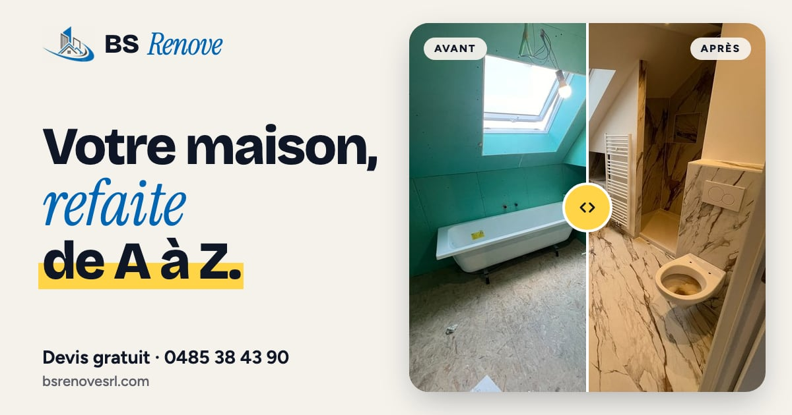
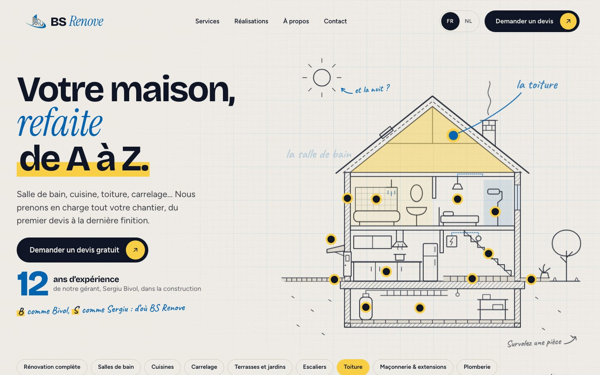
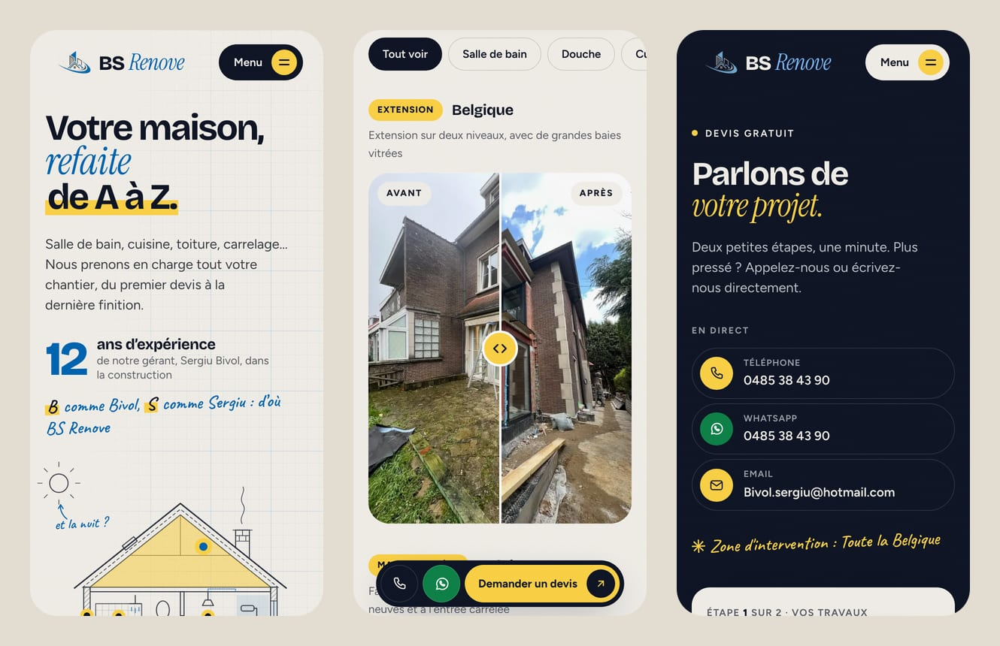
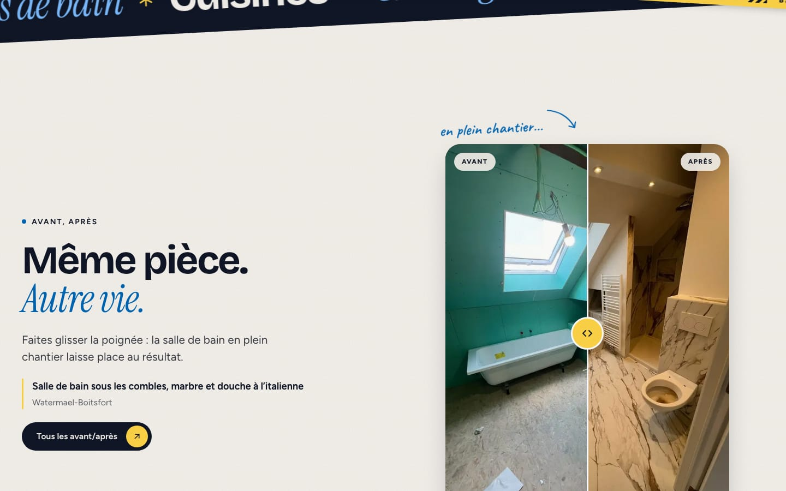

# BS Renove

**Le site de BS Renove SRL, entreprise générale de rénovation à Denderleeuw, active dans toute la Belgique.**

[bsrenovesrl.com](https://bsrenovesrl.com) · Français & Nederlands

---

## L'idée

Un propriétaire qui cherche quelqu'un pour refaire sa salle de bain, sa toiture ou toute sa maison veut surtout une chose : **voir le travail**. Le site est construit autour de ça. Il montre de vrais chantiers, avant et après, explique simplement ce que fait l'entreprise, et permet de demander un devis gratuit en une minute, depuis son téléphone.

---

## Ce qu'on y trouve

**🏠 Une maison dessinée en coupe**
Le haut de l'accueil montre une maison vue en coupe, qui se dessine trait par trait à l'arrivée puis fait visiter ses pièces une à une : toiture, salle de bain, cuisine, escalier, cave, allée… Chaque pièce mène au métier correspondant ou à ses avant/après. Et un clic sur le soleil fait passer la maison **en mode nuit** : lune, étoiles et fenêtres allumées.

**↔️ De vrais avant/après**
29 comparaisons de chantiers réels. On fait glisser la poignée jaune pour passer de l'avant à l'après, au doigt, à la souris ou au clavier. La page Réalisations les range par pièce : salle de bain, douche, cuisine, toiture, terrasse…

**🧰 11 métiers**
Rénovation complète, salles de bain, cuisines, carrelage, terrasses et jardins, escaliers, toiture, maçonnerie et extensions, plomberie, électricité, peinture et finitions. Chacun a sa description, ses exemples de travaux et son avant/après.

**📝 Un devis en deux étapes**
1. Les travaux envisagés, à cocher.
2. Le nom, le téléphone et un mot sur le projet.

Une fois la demande envoyée, le visiteur peut ajouter ses photos par **WhatsApp** ou par **email**, avec sa demande déjà écrite dans le message.

**📱 Pensé d'abord pour le téléphone**
Une barre toujours à portée de pouce (Appeler · WhatsApp · Devis), un menu plein écran, et le choix FR/NL directement en haut de l'écran.

**🇧🇪 En français et en néerlandais**
Toutes les pages et tous les textes existent dans les deux langues. Le site s'ouvre dans la langue du téléphone ou de l'ordinateur : néerlandais pour un appareil réglé en néerlandais, français pour tous les autres. Le visiteur peut changer à tout moment, et son choix est retenu.

### Les pages

| | Français | Nederlands |
|---|---|---|
| Accueil | Accueil | Startpagina |
| Les métiers | Services | Diensten |
| Les chantiers | Réalisations | Realisaties |
| L'entreprise | À propos | Over ons |
| Le devis | Contact | Contact |
| Recrutement | Rejoindre l'équipe | Word lid van ons team |
| Légal | Mentions légales · Vie privée | Juridische informatie · Privacy |

---

## Rapide, accessible, respectueux

**Rapide.** Le site s'affiche en un clin d'œil, même en 4G. Les photos sont servies à la bonne taille pour chaque écran et ne se chargent qu'au moment où on s'en approche.

| Lighthouse (mobile) | Performance | Accessibilité | Bonnes pratiques | SEO |
|---|:---:|:---:|:---:|:---:|
| Accueil | 94–98 | 100 | 100 | 100 |
| Services | 96 | 100 | 100 | 100 |
| Contact | 97 | 100 | 100 | 100 |
| Réalisations | 91–93 | 100 | 100 | 100 |

**Accessible.** Lisible par tous : contrastes suffisants, navigation complète au clavier, texte alternatif sur chaque photo, curseurs avant/après utilisables sans souris. Les animations s'arrêtent pour ceux qui ont demandé à en voir moins.

**Respectueux.** Aucun cookie, aucun outil de suivi, aucune publicité. Les photos de chantier ne contiennent aucune information de localisation, et seule la commune d'un chantier est indiquée, jamais l'adresse.

---

## Design

Une direction **« Atelier »** : le papier d'un carnet de chantier, le bleu nuit d'un plan, le bleu du logo, un trait de marqueur jaune et des annotations écrites à la main.

| | Couleur | Rôle |
|---|---|---|
|  | Papier `#F5F2EC` | Le fond, chaud et calme |
|  | Bleu nuit `#0F1626` | Titres, boutons, sections sombres |
|  | Bleu du logo `#0066B4` | Mots en italique, liens, annotations |
|  | Jaune marqueur `#FFD447` | Surlignages, poignées, pastilles |
|  | Vert WhatsApp `#0E8449` | Les boutons WhatsApp |

**Polices :** Bricolage Grotesque pour les titres, *Instrument Serif* pour les fins de titre en bleu, Figtree pour le texte, et Caveat pour les annotations manuscrites.

---

## Crédits

Site conçu et développé par **Claudiu Popadiuc**
[claudiu.dev@outlook.com](mailto:claudiu.dev@outlook.com?subject=Un%20site%20comme%20celui%20de%20BS%20Renove)

*Un site comme celui-ci pour votre entreprise ? Écrivez-moi.*

