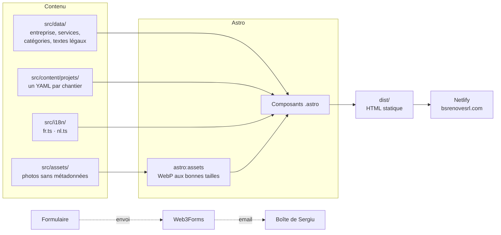

<div align="center">


# BS Renove

**Le site de BS Renove SRL, entreprise générale de rénovation à Denderleeuw, active dans toute la Belgique.**

[bsrenovesrl.com](https://bsrenovesrl.com) · Français & Nederlands · 100 % statique


</div>

---

## Sommaire

1. [En un coup d'œil](#en-un-coup-dœil)
2. [Démarrer](#démarrer)
3. [Ce que fait le site](#ce-que-fait-le-site)
4. [Comment c'est construit](#comment-cest-construit)
5. [Modifier le contenu (guides pas à pas)](#modifier-le-contenu)
6. [Mise en ligne](#mise-en-ligne)
7. [Performance, accessibilité, vie privée](#performance-accessibilité-vie-privée)
8. [Design](#design)
9. [Règles du projet](#règles-du-projet)
10. [Crédits](#crédits)

---

## En un coup d'œil


| | |
|---|---|
| **Objectif** | Qu'un propriétaire fasse confiance et demande un devis, par formulaire, téléphone ou WhatsApp |
| **Public** | Surtout sur téléphone (≈ 95 % des visites) |
| **Langues** | Français (`/`) et néerlandais (`/nl/`), toutes les pages, tous les textes |
| **Contenu** | 11 métiers, 29 avant/après réels, FAQ, pages légales complètes |
| **Technique** | Astro, sans base de données, sans serveur, sans cookie |

---

## Démarrer

```bash
npm install
npm run dev       # serveur local → http://localhost:4321
npm run build     # vérification des types + construction dans dist/
npm run preview   # aperçu du site construit
```

> **Le serveur local affiche une ancienne version ou le menu ne répond plus ?**
> Le cache s'est emmêlé : `Ctrl+C`, puis `rm -rf node_modules/.vite .astro`, puis `npm run dev`, et **Cmd+Maj+R** dans le navigateur.

Pour que le formulaire envoie vraiment les demandes en local, créer un fichier `.env` à la racine (il n'est jamais envoyé sur GitHub) :

```bash
WEB3FORMS_KEY=la-clé-web3forms
```

---

## Ce que fait le site

### Les pages

| Page | Français | Nederlands |
|---|---|---|
| Accueil | `/` | `/nl/` |
| Services | `/services/` | `/nl/diensten/` |
| Réalisations | `/realisations/` | `/nl/realisaties/` |
| À propos | `/a-propos/` | `/nl/over-ons/` |
| Contact et devis | `/contact/` | `/nl/contact/` |
| Rejoindre l'équipe | `/rejoindre-lequipe/` | `/nl/word-lid-van-ons-team/` |
| Mentions légales | `/mentions-legales/` | `/nl/juridische-informatie/` |
| Vie privée | `/vie-privee/` | `/nl/privacy/` |
| Page introuvable | `404` | `/nl/404/` |

Le sélecteur FR/NL mène toujours à **la même page** dans l'autre langue ; sur téléphone, il est directement dans l'en-tête.

**Langue automatique** : à l'arrivée, un appareil réglé en néerlandais voit le site en NL, tous les autres en FR. Un choix fait avec le sélecteur est retenu et prime ensuite. Rien ne se passe pendant la navigation interne, ni pour les robots (Google, aperçus WhatsApp).

### Les éléments marquants

**🏠 La maison en coupe** (`MaisonCoupe.astro`)
Un dessin SVG qui se trace à l'arrivée, puis fait visiter ses pièces une à une. Chaque pièce (toiture, salle de bain, cuisine, cave, escalier, allée…) mène à son métier ou à ses avant/après. Un clic sur le soleil passe la maison **en mode nuit** : lune, étoiles, fenêtres allumées.

**↔️ Les curseurs avant/après** (`CurseurAvantApres.astro`)
Deux photos superposées, une poignée jaune qu'on fait glisser. Construit autour d'un vrai `<input type="range">` : ça marche **à la souris, au doigt et au clavier**, sans aucune librairie.


**📝 Le devis en deux étapes** (`FormulaireDevis.astro`)
1. Les travaux (tuiles à cocher, plusieurs choix possibles).
2. Nom, téléphone, email et un mot sur le projet.

Après l'envoi, le visiteur peut envoyer ses photos **par WhatsApp ou par email**, avec sa demande déjà écrite dans le message. Sans clé Web3Forms, le formulaire ouvre sa messagerie avec toute la demande pré-remplie : il ne perd jamais un client.

**📱 Pensé pour le téléphone**
Dock flottant en bas (Appeler · WhatsApp · Devis), menu plein écran, zones tactiles d'au moins 44 px, testé de 320 à 1440 px de large.

---

## Comment c'est construit



### L'arborescence

```
src/
├── pages/                Une page par adresse (FR à la racine, NL sous nl/)
├── layouts/
│   └── BaseLayout.astro  <head>, SEO, hreflang, image de partage, en-tête, pied de page
├── components/
│   ├── accueil/          Sections de l'accueil : Hero, MaisonCoupe, AvantApres, Methode, Faq…
│   ├── sections/         Contenu des pages intérieures : Services, Réalisations, À propos, pages légales
│   └── *.astro           Briques communes : Bouton, Icon, Logo, CurseurAvantApres,
│                         GrilleAvantApres, FormulaireDevis, Entete, PiedDePage…
├── content/projets/      Un fichier YAML par chantier : sa commune et ses avant/après
├── data/
│   ├── entreprise.ts     Faits vérifiés : nom, adresse, téléphone, TVA, RPM, hébergeur
│   ├── services.ts       Les 11 métiers (textes FR/NL, exemples, icônes)
│   ├── categories.ts     Les types de pièce (filtres de la page Réalisations)
│   ├── projets.ts        Quelles paires vont où : vitrine, accueil, chaque métier
│   └── textes-legaux.ts  Mentions légales et vie privée (FR/NL)
├── i18n/                 Tous les textes d'interface (fr.ts et nl.ts, même structure)
├── scripts/site.ts       Défilement fluide (Lenis), apparitions au défilement
├── styles/               tokens.css (couleurs, tailles, rayons) et global.css
└── assets/               Photos des chantiers, logo, images de partage

scripts/                  Outils locaux (voir plus bas)
docs/                     brief.md, suivi-client.md, captures du README
netlify.toml              Construction, cache, en-têtes de sécurité, 404 néerlandaise
```

### Les outils du dossier `scripts/`

| Script | À quoi il sert |
|---|---|
| `importer-photos.mjs` | Importe des photos de chantier **en effaçant leurs métadonnées** (dont la position GPS de la maison du client) |
| `generer-image-partage.mjs` | Fabrique l'image affichée quand on partage le lien sur WhatsApp ou Facebook (FR et NL) |
| `scanner-tags-finder.mjs` · `decoder-tags-finder.mjs` | Retrouvent les photos triées avec des tags Finder sur le Mac |

---

## Modifier le contenu

<details>
<summary><b>➕ Ajouter un avant/après</b></summary>

1. **Masquer** d'abord tout numéro de maison, visage ou plaque sur les photos.
2. Importer les deux photos **sans métadonnées** :
   ```bash
   node scripts/importer-photos.mjs ~/Desktop/mes-photos nom-du-chantier
   ```
3. Ajouter la paire dans `src/content/projets/nom-du-chantier.yaml` :
   ```yaml
   commune:                 # facultatif : sans commune, le site affiche « Belgique »
     fr: Denderleeuw
     nl: Denderleeuw
   ordre: 20
   avantApres:
     - avant: ../../assets/projets/nom-du-chantier/avant-1.jpg
       apres: ../../assets/projets/nom-du-chantier/apres-1.jpg
       legende:
         fr: Ce qui a été fait
         nl: Wat er gedaan is
       categorie: salle-de-bain   # voir src/data/categories.ts
       # facultatif : depart (position de la poignée en %), cadrageAvant / cadrageApres (ex. « 50% 20% »)
   ```

La paire apparaît **toute seule** sur la page Réalisations et dans le métier correspondant (`CATEGORIES_PAR_SERVICE` dans `src/data/projets.ts`).
Pour la mettre sur l'accueil, ajouter son identifiant `nom-du-chantier/apres-1` à `IDS_ACCUEIL` (3 exemples sous la vitrine).

</details>

<details>
<summary><b>📍 Ajouter la commune d'un chantier</b></summary>

Dans le fichier du chantier (`src/content/projets/*.yaml`), ajouter en haut :

```yaml
commune:
  fr: Woluwe-Saint-Pierre
  nl: Sint-Pieters-Woluwe
```

Seulement la commune, **jamais la rue ni le numéro**.

</details>

<details>
<summary><b>☎️ Changer le téléphone, l'email ou l'adresse</b></summary>

Tout est dans **un seul fichier** : `src/data/entreprise.ts`. Le site entier suit (en-tête, dock, formulaire, pied de page, pages légales, données Google).

</details>

<details>
<summary><b>✏️ Changer un texte</b></summary>

- Textes d'interface : `src/i18n/fr.ts` **et** `src/i18n/nl.ts` (même structure, TypeScript vérifie qu'aucun texte ne manque).
- Métiers : `src/data/services.ts`.
- Pages légales : `src/data/textes-legaux.ts`.

</details>

<details>
<summary><b>🧰 Masquer ou réafficher un métier</b></summary>

`NON_ENREGISTRES` dans `src/data/services.ts` : un métier ajouté à cette liste disparaît de l'accueil, de la page Services, du formulaire et de la maison dessinée.

</details>

<details>
<summary><b>🖼️ Refaire l'image de partage</b></summary>

```bash
node scripts/generer-image-partage.mjs
```

Écrit `src/assets/partage.jpg` (FR) et `src/assets/partage-nl.jpg` (NL), 1200 × 630.

</details>

---

## Mise en ligne

| Élément | Où | Détail |
|---|---|---|
| **Hébergement** | Netlify | Construit automatiquement à chaque `git push` sur `main` (`netlify.toml`) |
| **Domaine** | Wix | `bsrenovesrl.com`, renouvelé chaque année. Le forfait Premium Wix n'est plus utilisé |
| **DNS** (chez Wix) | Enregistrements | `A @ → 75.2.60.5` · `CNAME www → bs-renove.netlify.app` |
| **HTTPS** | Netlify | Certificat Let's Encrypt automatique |
| **Formulaire** | Web3Forms | Variable `WEB3FORMS_KEY` dans Netlify → *Environment variables* |

> ⚠️ Dans Wix, page **Domaines** : ne jamais cliquer sur **« Réessayer »** ou **« Connecter »**. Cela remettrait le domaine sur un site Wix et le site disparaîtrait.

---

## Performance, accessibilité, vie privée

**Lighthouse, sur mobile, sur le site en ligne (septembre 2026)**

| Page | Performance | Accessibilité | Bonnes pratiques | SEO |
|---|:---:|:---:|:---:|:---:|
| Accueil | 94–98 | 100 | 100 | 100 |
| Services | 96 | 100 | 100 | 100 |
| Contact | 97 | 100 | 100 | 100 |
| Réalisations (58 photos) | 91–93 | 100 | 100 | 100 |

**Ce qui rend le site rapide**
- Aucun framework côté navigateur : un peu de JavaScript vanilla, et Lenis pour le défilement fluide.
- Photos en WebP aux bonnes tailles (`astro:assets`), chargées quand on s'en approche. Seule la première photo visible est prioritaire.
- Polices hébergées sur le site et préchargées. Fichiers `/_astro/` gardés en cache un an.

**Accessibilité**
Contraste AA, focus clavier visible, vrais `<button>` et `<a>`, texte alternatif sur chaque photo, curseurs utilisables au clavier. Toutes les animations se coupent avec `prefers-reduced-motion`, et le site reste utilisable sans JavaScript.

**Vie privée**
- **Aucun cookie**, aucun outil de statistiques, aucun appel à Google Fonts.
- Les photos sont importées **sans métadonnées** : aucune position GPS de maison client.
- Pas de carte Google intégrée : elle déposerait des cookies et montrerait le domicile du gérant.

**Référencement**
`title` et description propres à chaque page et langue, `hreflang` (fr-BE, nl-BE, x-default), `sitemap.xml`, données structurées `HomeAndConstructionBusiness`, image de partage par langue.

---

## Design

Direction **« Atelier »** : papier chaud, bleu nuit, bleu du logo, jaune de marqueur et annotations écrites à la main.

| | Couleur | Usage |
|---|---|---|
|  | `#F5F2EC` Papier | Fond de page |
|  | `#0F1626` Bleu nuit | Titres, boutons, sections sombres. **Jamais de noir** |
|  | `#0066B4` Bleu du logo | Mots en italique, liens, annotations |
|  | `#FFD447` Jaune marqueur | Surlignages, poignées, pastilles |
|  | `#0E8449` Vert WhatsApp | Boutons WhatsApp |

**Polices** (hébergées via Fontsource) : **Bricolage Grotesque** pour les titres, ***Instrument Serif*** pour les fins de titre en bleu, **Figtree** pour le texte, et **Caveat** pour les annotations manuscrites.

Toutes les valeurs sont dans `src/styles/tokens.css` : changer une couleur, c'est une ligne.

---

## Règles du projet

Les règles complètes sont dans [`CLAUDE.md`](CLAUDE.md). L'essentiel :

- **Ne jamais inventer** d'information sur l'entreprise : chiffres, garanties, avis, certifications.
- **Jamais d'adresse client** : seulement la commune, ou « Belgique ». Numéros de maison et visages masqués.
- **Uniquement de vrais avant/après**, jamais d'image générée présentée comme un chantier.
- **Tout texte existe en FR et en NL.**
- Le site est en production : **aucune mention « à confirmer » ou provisoire** ne doit apparaître.
- À chaque changement : `npm run build` sans erreur, commit clair, push sur `main`.

Le suivi avec le client (améliorations possibles, points administratifs) est dans [`docs/suivi-client.md`](docs/suivi-client.md), et le contenu page par page dans [`docs/brief.md`](docs/brief.md).

---

## Crédits

<div align="center">

Site conçu et développé par **Claudiu Popadiuc**
[claudiu.dev@outlook.com](mailto:claudiu.dev@outlook.com?subject=Un%20site%20comme%20celui%20de%20BS%20Renove)

*Un site comme celui-ci pour votre entreprise ? Écrivez-moi.*

</div>
