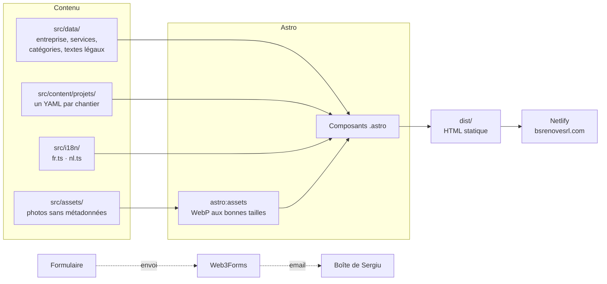

# Guide technique (interne)

Tout ce qui sert à faire vivre le site : lancer le projet, modifier le contenu, mise en ligne. Le README, lui, présente le site.

## Démarrer

```bash
npm install
npm run dev       # serveur local → http://localhost:4321
npm run build     # vérification des types + construction dans dist/
npm run preview   # aperçu du site construit
```

> **Le serveur local affiche une ancienne version ou le menu ne répond plus ?**
> Le cache s'est emmêlé : `Ctrl+C`, puis `rm -rf node_modules/.vite .astro`, puis `npm run dev`, et **Cmd+Maj+R** dans le navigateur.

Pour que le formulaire envoie vraiment les demandes en local, créer un fichier `.env` à la racine (il n'est jamais envoyé sur GitHub) :

```bash
WEB3FORMS_KEY=la-clé-web3forms
```

## Comment c'est construit



### L'arborescence

```
src/
├── pages/                Une page par adresse (FR à la racine, NL sous nl/)
├── layouts/
│   └── BaseLayout.astro  <head>, SEO, hreflang, image de partage, en-tête, pied de page
├── components/
│   ├── accueil/          Sections de l'accueil : Hero, MaisonCoupe, AvantApres, Methode, Faq…
│   ├── sections/         Contenu des pages intérieures : Services, Réalisations, À propos, pages légales
│   └── *.astro           Briques communes : Bouton, Icon, Logo, CurseurAvantApres,
│                         GrilleAvantApres, FormulaireDevis, Entete, PiedDePage…
├── content/projets/      Un fichier YAML par chantier : sa commune et ses avant/après
├── data/
│   ├── entreprise.ts     Faits vérifiés : nom, adresse, téléphone, TVA, RPM, hébergeur
│   ├── services.ts       Les 11 métiers (textes FR/NL, exemples, icônes)
│   ├── categories.ts     Les types de pièce (filtres de la page Réalisations)
│   ├── projets.ts        Quelles paires vont où : vitrine, accueil, chaque métier
│   └── textes-legaux.ts  Mentions légales et vie privée (FR/NL)
├── i18n/                 Tous les textes d'interface (fr.ts et nl.ts, même structure)
├── scripts/site.ts       Défilement fluide (Lenis), apparitions au défilement
├── styles/               tokens.css (couleurs, tailles, rayons) et global.css
└── assets/               Photos des chantiers, logo, images de partage

scripts/                  Outils locaux (voir ci-dessous)
docs/                     brief.md, suivi-client.md, captures du README
netlify.toml              Construction, cache, en-têtes de sécurité, 404 néerlandaise
```

### Les outils du dossier `scripts/`

| Script | À quoi il sert |
|---|---|
| `importer-photos.mjs` | Importe des photos de chantier **en effaçant leurs métadonnées** (dont la position GPS de la maison du client) |
| `generer-image-partage.mjs` | Fabrique l'image affichée quand on partage le lien sur WhatsApp ou Facebook (FR et NL) |
| `scanner-tags-finder.mjs` · `decoder-tags-finder.mjs` | Retrouvent les photos triées avec des tags Finder sur le Mac |


## Modifier le contenu

<details>
<summary><b>➕ Ajouter un avant/après</b></summary>

1. **Masquer** d'abord tout numéro de maison, visage ou plaque sur les photos.
2. Importer les deux photos **sans métadonnées** :
   ```bash
   node scripts/importer-photos.mjs ~/Desktop/mes-photos nom-du-chantier
   ```
3. Ajouter la paire dans `src/content/projets/nom-du-chantier.yaml` :
   ```yaml
   commune:                 # facultatif : sans commune, le site affiche « Belgique »
     fr: Denderleeuw
     nl: Denderleeuw
   ordre: 20
   avantApres:
     - avant: ../../assets/projets/nom-du-chantier/avant-1.jpg
       apres: ../../assets/projets/nom-du-chantier/apres-1.jpg
       legende:
         fr: Ce qui a été fait
         nl: Wat er gedaan is
       categorie: salle-de-bain   # voir src/data/categories.ts
       # facultatif : depart (position de la poignée en %), cadrageAvant / cadrageApres (ex. « 50% 20% »)
   ```

La paire apparaît **toute seule** sur la page Réalisations et dans le métier correspondant (`CATEGORIES_PAR_SERVICE` dans `src/data/projets.ts`).
Pour la mettre sur l'accueil, ajouter son identifiant `nom-du-chantier/apres-1` à `IDS_ACCUEIL` (3 exemples sous la vitrine).

</details>

<details>
<summary><b>📍 Ajouter la commune d'un chantier</b></summary>

Dans le fichier du chantier (`src/content/projets/*.yaml`), ajouter en haut :

```yaml
commune:
  fr: Woluwe-Saint-Pierre
  nl: Sint-Pieters-Woluwe
```

Seulement la commune, **jamais la rue ni le numéro**.

</details>

<details>
<summary><b>☎️ Changer le téléphone, l'email ou l'adresse</b></summary>

Tout est dans **un seul fichier** : `src/data/entreprise.ts`. Le site entier suit (en-tête, dock, formulaire, pied de page, pages légales, données Google).

</details>

<details>
<summary><b>✏️ Changer un texte</b></summary>

- Textes d'interface : `src/i18n/fr.ts` **et** `src/i18n/nl.ts` (même structure, TypeScript vérifie qu'aucun texte ne manque).
- Métiers : `src/data/services.ts`.
- Pages légales : `src/data/textes-legaux.ts`.

</details>

<details>
<summary><b>🧰 Masquer ou réafficher un métier</b></summary>

`NON_ENREGISTRES` dans `src/data/services.ts` : un métier ajouté à cette liste disparaît de l'accueil, de la page Services, du formulaire et de la maison dessinée.

</details>

<details>
<summary><b>🖼️ Refaire l'image de partage</b></summary>

```bash
node scripts/generer-image-partage.mjs
```

Écrit `src/assets/partage.jpg` (FR) et `src/assets/partage-nl.jpg` (NL), 1200 × 630.

</details>


## Mise en ligne

| Élément | Où | Détail |
|---|---|---|
| **Hébergement** | Netlify | Construit automatiquement à chaque `git push` sur `main` (`netlify.toml`) |
| **Domaine** | Wix | `bsrenovesrl.com`, renouvelé chaque année. Le forfait Premium Wix n'est plus utilisé |
| **DNS** (chez Wix) | Enregistrements | `A @ → 75.2.60.5` · `CNAME www → bs-renove.netlify.app` |
| **HTTPS** | Netlify | Certificat Let's Encrypt automatique |
| **Formulaire** | Web3Forms | Variable `WEB3FORMS_KEY` dans Netlify → *Environment variables* |

> ⚠️ Dans Wix, page **Domaines** : ne jamais cliquer sur **« Réessayer »** ou **« Connecter »**. Cela remettrait le domaine sur un site Wix et le site disparaîtrait.

---

## Règles du projet

Les règles complètes sont dans [`CLAUDE.md`](../CLAUDE.md). L'essentiel :

- **Ne jamais inventer** d'information sur l'entreprise : chiffres, garanties, avis, certifications.
- **Jamais d'adresse client** : seulement la commune, ou « Belgique ». Numéros de maison et visages masqués.
- **Uniquement de vrais avant/après**, jamais d'image générée présentée comme un chantier.
- **Tout texte existe en FR et en NL.**
- Le site est en production : **aucune mention « à confirmer » ou provisoire** ne doit apparaître.
- À chaque changement : `npm run build` sans erreur, commit clair, push sur `main`.

Le suivi avec le client (améliorations possibles, points administratifs) est dans [`suivi-client.md`](suivi-client.md), et le contenu page par page dans [`brief.md`](brief.md).
